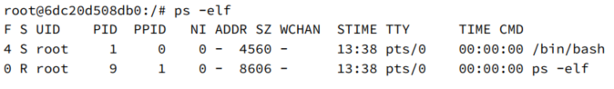
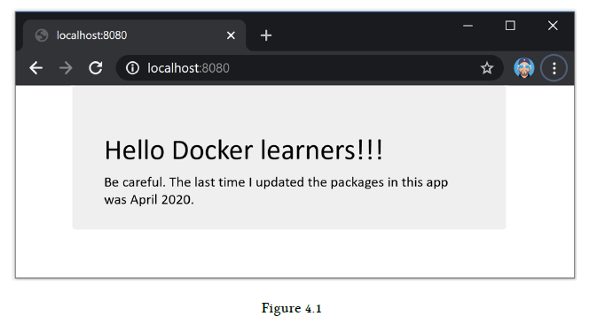
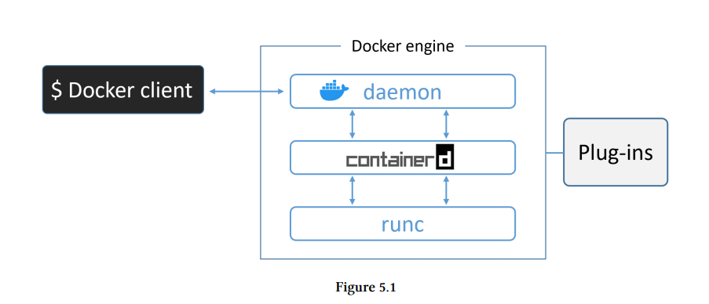
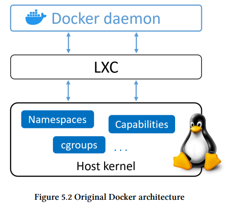
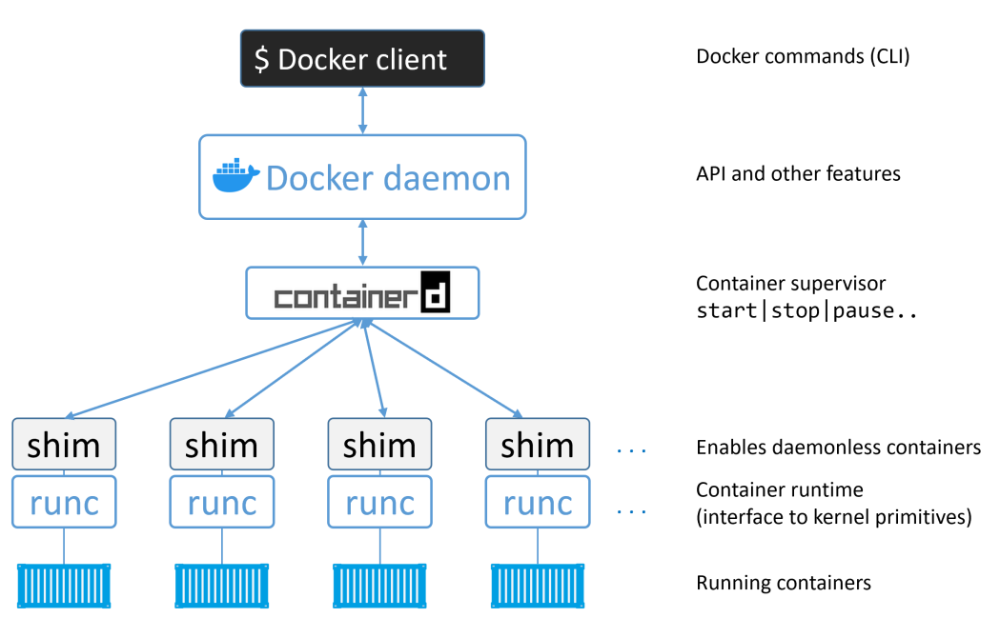
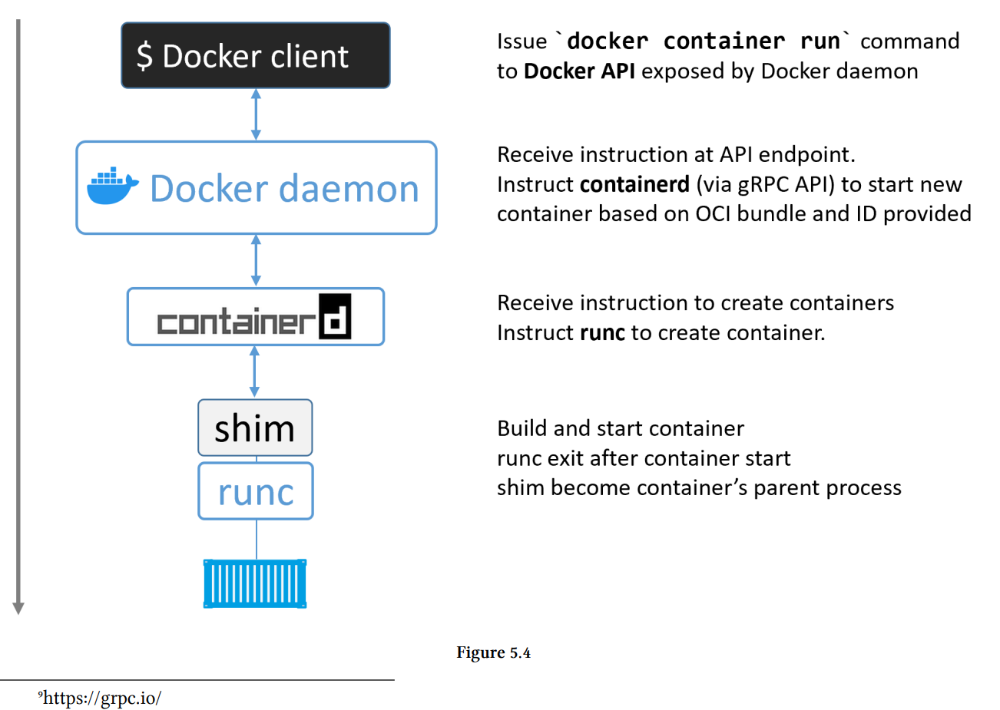
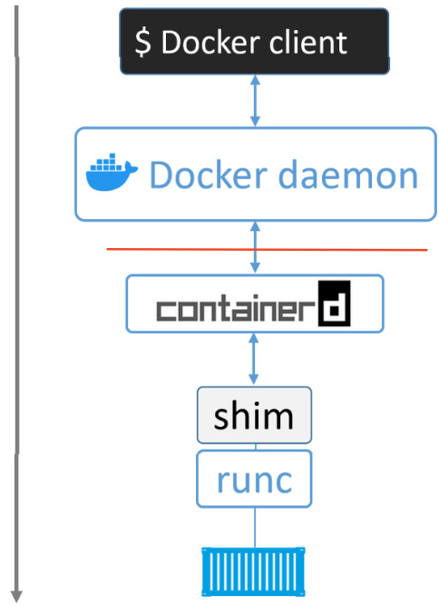

# Docker

---

## Installing Docker on Linux

```bash

$ sudo apt-get update
$ sudo apt-get remove docker docker-engine docker.io containerd runc

$ sudo apt-get update
$ sudo apt-get install ca-certificates curl gnupg lsb-release

$ curl -fsSL https://download.docker.com/linux/ubuntu/gpg | sudo gpg --dearmor -o /usr/share/keyrings/docker-archive-keyring.gpg

$ echo \
  "deb [arch=$(dpkg --print-architecture) signed-by=/usr/share/keyrings/docker-archive-keyring.gpg] https://download.docker.com/linux/ubuntu \
  $(lsb_release -cs) stable" | sudo tee /etc/apt/sources.list.d/docker.list > /dev/null


$ sudo apt-get update --allow-unauthenticated --allow-insecure-repositories
$ sudo apt-get install docker-ce docker-ce-cli containerd.io

$ sudo docker --version
$ sudo docker info

```

**note: you might need to add your user account to the local docker group rather than using "sudo" always**

- To check the current local groups:  
    `$ sudo getent group`  
- To check the groups you're currently in:  
    `$ groups`  
- To add a user to the local docker group:  
    `$ sudo usermod -a -G docker <username>`  
    `$ groups`  

---

## Images

A Docker image is an object that includes OS filesystem, application, and application dependencies. Just like the virtual machine template, it can also be thought of as the concept of class.

List all images
`$ docker image ls`

Pull the `ubuntu:latest` image  
`$ docker image pull ubuntu:latest`

Looking at the docker image again it will become
`$ docker images ls`

---

## Containers

we have an image on the local side, and then use `docker container run` the command to start the container.

Launch a container from an image  
`$ docker container run -it ubuntu:latest /bin/bash`

- `docker container run` Tell Docker to start a container
- `-it` Make the container `interactive`, and use the corresponding shell at the terminal (atatch the current shell to the container's terminal)
  - `-i`: Keep STDIN open even if not attached
  - `-t`: Allocate a pseudo-TTY

Next, execute in the container `ps` to observe the running program


There are only two programs in Linux

- PID1. for container `bin/bash`
- PID9. for program `ps -elf`

To leave the container
` Ctrl + P`, `Ctrl + Q,`

Execute after leaving `docker container ls` and you can see that the container is still running.

```bash
$ docker container ls
CONTAINER ID IMAGE COMMAND CREATED STATUS NAMES
6dc20d508db0 ubuntu:latest "/bin/bash" 7 mins Up 7 min vigilant_borg
```

Attach to a running container 
`docker container exec <options> <container-name or container-id> <command/app>`

```bash
$ docker container exec -it vigilant_borg bash
root@6dc20d508db0:/#
```

`$ docker container exec -it <containername> bash`

Stop a running container  
`$ docker container stop <containername>`

Start a stopped container  
`$ docker container start <containername>`  

Delete a stopped container  
`$ docker container rm <containername>`  

List running containers
`docker container ls`

List all containers (including non-running)
`docker container ls -a`

---

## The Dev Perspective

this section will

- Pull the code from GitHub
- Take a look at the Dockerfile
- build Docker image
- run Docker container

**Examples for Linux sample nodejs web app**

```bash
$ git clone https://github.com/nigelpoulton/psweb.git

$ cd psweb
$ ls -l

total 40
-rw-r--r--@ 1 ubuntu ubuntu 338 24 Apr 19:29 Dockerfile
-rw-r--r--@ 1 ubuntu ubuntu 396 24 Apr 19:32 README.md
-rw-r--r--@ 1 ubuntu ubuntu 341 24 Apr 19:29 app.js
-rw-r--r--  1 ubuntu ubuntu 216 24 Apr 19:29 circle.yml
-rw-r--r--@ 1 ubuntu ubuntu 377 24 Apr 19:36 package.json
drwxr-xr-x  4 ubuntu ubuntu 128 24 Apr 19:29 test
drwxr-xr-x  3 ubuntu ubuntu  96 24 Apr 19:29 views
```

Let's take a look at the Dockerfile for the Linux app

```docker
# Test web-app to use with Pluralsight courses and Docker Deep Dive book
# Linux x64
FROM alpine

LABEL maintainer="nigelpoulton@hotmail.com"

# Install Node and NPM
RUN apk add --update nodejs npm curl

# Copy app to /src
COPY . /src

WORKDIR /src

# Install dependencies
RUN  npm install

EXPOSE 8080

ENTRYPOINT ["node", "./app.js"]
```

**Build the image**

`docker image build -t test:latest .`

`docker image build` Takes a while to run, as it pulls gigabytes of stuff.

Check the list to confirm that the image has been built successfully

```bash
$ docker image ls
REPO TAG IMAGE ID CREATED SIZE
test latest f154cb3ddbd4 1 minute ago 81.5MB
```

Run with container run

```bash
$ docker container run -d  --name web1 --publish 8080:8080 test:latest
```

open your browser and check the contianer working fine.


---

## The Docker Engine

You can use Docker without understanding the contents of this topic, but to become a real Docker master, you need to have a deeper understanding of `Docker Engine`.

`Docker Engine` is the core software that executes and manages containers, we usually call it Docker

The `Docker Engine` is made from many specialized tools that work together to create and run containers

The main components of Docker engine are

- Docker daemon
- containerd
- runc
- plugins (eg networking, storage)



## Docker Engine - The Deep Dive

The original Docker entine contains:

- The Docker daemon: monolithic binary, including Docker client, Docker API, the container runtime, image builds and many more.
- LXC: Provides daemon access to fundamental building-blocks of containers stored in the Linux kernel. Like namespaces and control groups (cgroups).
  


## Getting rid of LXC

1. LXC is Linux-specific. It is a problem for projects that want to be multi-platform
2. Relying on external tools for something so core to the project is a huge risk and can hinder development

Therefore, Docker. Inc developed its own tool - `libcontainer` to replace LXC. The goal of `libcontainer` is a platform-agnostic tool that allows Docker to access the fundamental container building-blocks in the host kernel.

`Libcontainer` replaced `LXC` as the default execution driver in Docker 0.9.

### Getting rid of the monolithic Docker daemon

Gradually, a single Docker daemon becomes more and more problematic:

1. hard to innovate
2. slower and slower
3. Not what this ecology wants

Docker, Inc. started to modularize the daemon after noticing this problem. The purpose is to disassemble the functions and re-implement them into smaller special tools. These special tools can be replaced or simply re- use to generate other tools. The project follows the tried-and-tested Unix philosophy - small specialized tools can be cobbled together into larger tools.

All container execution and container runtime programs are removed from the daemon, and refactored into small dedicated tools.



### The influence of the Open Container Initiative (OCI)

Docker, Inc. began to remove the function from the daemon, and OCI began to formulate two specs related to the container:

- [Image spec](https://github.com/opencontainers/image-spec)
- [Container runtime spec](https://github.com/opencontainers/runtime-spec)

the Docker daemon no longer contains any container runtime code, and the container runtime code is implemented in the OCI-compliant layer.

Docker uses `runc` to implement OCI container-runtime-spec, according to its official documentation:
`runc is a CLI tool for spawning and running containers according to the OCI specification.`

### runc

runc is a lightweight CLI wrapper for libcontainer(libcontainer initially replaced LXC as the interface with the host OS), its main purpose is to create containers, which means that with this set of tools and with appropriate settings, you can easily Create an OCI-compliant Container to run.

### containerd

All container execution logic is extracted into containerd, whose sole purpose is to manage container lifecycle operations `start | stop | pause | rm....`, containerd is between docker daemon and runc.

At the beginning, the design goal of containerd was a small & lightweight tool with a single goal of managing container lifecycle operations, but as time evolved, it was added with many additional functions, such as `pull images, volume, and network`.

### Starting a new container (example)

The most common way to start a container is to use the Docker CLI:
`$ docker container run --name ctr1 -it alpine:latest sh`

When you input commands into Docker CLI, Docker client will convert the command into appropriate API payload and pass it to Docker daemon. In Linux, daemon will use local socket( ) to receive API /var/run/docker.sockcontent.

Once the daemon receives the command to create a container, the daemon notifies containerd through CRUD-style API over gRPC.

Then containerd will be responsible for converting the required Docker image into an OCI bundle, and finally pass it to runc to create a new container.

runc is responsible for creating a new container, and the container process will run as a child-process of runc. After the container runs, runc will terminate and hand over the process of its program to the upper-level grandfather( ) to manage `shim`.



### One huge benefit of this model

The container runtime and Docker daemon can be decoupled by removing the logic and code for starting and managing the container from the daemon. This kind of container is called "daemonless containers"


In this way, the daemon can be maintained and upgraded without affecting the operation of the existing container

Considering that docker often releases new versions, this is very harmful to the production environment!

To solve this problem, `shim` was born!

### What’s this shim all about?

we mentioned that `containerd` will use `runc` to create containers, more precisely, `containerd` will fork new runc instances to create containers (n containers will have n runcs)

However, once the container is created, the `runc` ends, which means we can create hundreds of containers but do not need to execute hundreds of `runcs` because after the `runc` ends, the parent process of the container becomes `containerd-shim`

Shim 's responsibilities include

- Keep STDIN and STDOUT open, so that the container will not stop running because the pipe is closed due to restarting the daemon
- Report container status to daemon

### How it’s implemented on Linux

Docker splits the above model into the following binaries for implementation:

- dockerd (the Docker daemon)
- docker-containerd (containerd)
- docker-containerd-shim (shim)
- docker-runc (runc)

You can see these processes by using `ps` the command

### What’s the point of the daemon

The Docker daemon is still responsible for

- image management
- image builds
- REST API
- authentication
- security
- core networking,
- orcestration.


